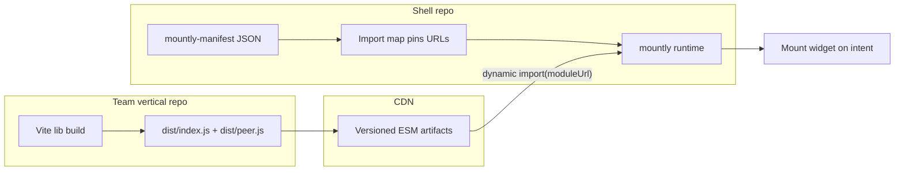

# Micro-frontends with mountly

mountly runs multi-team frontends on **Vite, ESM, and import maps**.

## The five-step model

1. **Vite builds ESM.** Each vertical repo uses `mountly-vite-plugin` to emit `dist/index.js` (self-contained) and `dist/peer.js` (shared peers).
2. **CDN hosts ESM.** Teams publish immutable versioned artifacts (`billing@2.1.0/dist/peer.js`).
3. **Import map pins versions.** The host shell maps bare specifiers to CDN URLs.
4. **Runtime loads + mounts widgets.** `installPlatformRuntime()` + `defineMountlyFeatureFromManifest()` (or `createOnDemandFeature({ moduleUrl })`).
5. **Manifest describes verticals.** `mountly-manifest` JSON lists platform deps and vertical entries per team.



## Repo topology

| Location                                                                               | Owns                                                      | Release cadence          |
| -------------------------------------------------------------------------------------- | --------------------------------------------------------- | ------------------------ |
| **Platform monorepo** (`mountly`, adapters, `mountly-vite-plugin`, `mountly-manifest`) | SDK, schemas, build plugin                                | Slow semver npm releases |
| **Vertical repos**                                                                     | Product widgets (`npx mountly init`)                      | Fast CDN deploys         |
| **Host shell repo**                                                                    | Static HTML, Next, or Vite app + manifest per environment | Per env                  |

Vertical product code does **not** belong in the platform monorepo. Examples like `docs/examples/payment-breakdown` are reference verticals only.

## Manifest schema (v2)

```json
{
  "$schema": "https://mountly.dev/schema/manifest.schema.json",
  "version": "2",
  "platform": {
    "imports": {
      "react": "https://esm.sh/react@19.2.7",
      "react/jsx-runtime": "https://esm.sh/react@19.2.7/jsx-runtime",
      "react-dom": "https://esm.sh/react-dom@19.2.7",
      "react-dom/client": "https://esm.sh/react-dom/client",
      "mountly": "https://cdn.example.com/mountly@0.2.3/dist/index.js",
      "mountly-react": "https://cdn.example.com/mountly-react@1.0.1/dist/index.js"
    }
  },
  "verticals": [
    {
      "id": "payment-breakdown",
      "team": "payments",
      "version": "1.2.0",
      "url": "https://cdn.example.com/payment-breakdown@1.2.0/dist/peer.js",
      "featureExport": "paymentBreakdown",
      "exports": {
        "./PaymentBreakdown": "./PaymentBreakdown.js"
      }
    },
    {
      "id": "chat-widget",
      "team": "cx",
      "url": "https://cdn.example.com/chat@3.0.0/dist/peer.js",
      "moduleExport": "default"
    }
  ]
}
```

### Vertical entry fields

| Field           | Purpose                                                                                                                |
| --------------- | ---------------------------------------------------------------------------------------------------------------------- |
| `id`            | `module-id` for `<mountly-feature>` and registry                                                                       |
| `url`           | CDN URL to `peer.js` (also registered as import map entry under `id` or `alias`)                                       |
| `team`          | Documentation / governance only                                                                                        |
| `version`       | Documentation / pinning policy                                                                                         |
| `featureExport` | Named export that is already an `OnDemandFeature`                                                                      |
| `moduleExport`  | Named export that satisfies `FeatureModule` (`mount` / `unmount`)                                                      |
| `alias`         | Optional bare specifier for the import map (e.g. `@acme/chat`)                                                         |
| `exports`       | Subpath map: `"./Checkout": "./Checkout.js"` resolves as `billing/Checkout`                                            |
| `baseUrl`       | Prefix for relative export paths (defaults to the directory of `url`)                                                  |
| `types`         | Optional type metadata. Usually omitted because Vite hosts infer the `./types/*` declaration convention automatically. |

## Authoring a remote (Vite)

Add `mountlyRemote` to the remote's `vite.config.ts` and run `vite build`. No build script, and no `shared` block to keep in sync with the host: the framework peers are externalized, and the host provides them through its import map.

```ts
// vite.config.ts
import react from "@vitejs/plugin-react";
import { defineConfig } from "vite";
import { mountlyRemote } from "mountly-vite-plugin";

export default defineConfig({
  plugins: [
    react(),
    mountlyRemote({
      name: "checkout",
      exposes: { ".": "src/index.ts", "./Cart": "src/Cart.tsx" },
    }),
  ],
});
```

`vite build` emits each exposed entry, `mountly.manifest.fragment.json` (the host composes hosts from these), and `.d.ts` files so the host's `import("checkout/Cart")` is typed. The host imports it as native ESM: no `virtual:` module, no top-level-await target, no per-remote `shared` declaration.

For the standalone-widget distribution (a self-contained `dist/index.js` that bundles its framework and drops into any page), use `defineMountlyWidgetConfig` instead. See [Self-contained vs peer build](#self-contained-vs-peer-build).

## Host integration

> **Single-app (SPA) routing across remotes?** mountly stays import-map-native. It does not ship an SPA shell or share-scope runtime. The import map already pins one URL per bare specifier, so the browser loads one React. Use your router's own lazy-route loading (e.g. TanStack Router's `createLazyRoute`) to `import()` a remote vertical when its route activates. No admission layer is needed: a remote either resolves against the host's import map or fails loudly.

### Remotes by URL (Vite)

Declare a remote by its published URL. This is the federation-style host config, but the host fetches the remote's `mountly.manifest.fragment.json` (the file `mountlyRemote` emits) and auto-wires the import map **and** types from it:

```ts
// vite.config.ts
mountlyHostPlugin({
  remotes: { checkout: "https://cdn.example.com/checkout/" },
});
```

The host imports `import("checkout/Cart")` as typed native ESM. No local fragment file and no `shared` block: React is shared through the import map. Use `verticals: [{ fragment }]` instead when the remote builds in the same repo, or `devOrigins` to override a manifest remote's origin in dev. See [`vite-host-remotes-url`](../docs/examples/vite-host-remotes-url).

### Widget / island mode

`bootstrapMountly()` does the whole boot in one call (fetch the manifest, inject the import map, then define features) in the order that avoids the bare-specifier race. Load it from `mountly/runtime` by **absolute URL** (it has no bare-specifier dependencies, so it resolves before any import map exists); everything after it can use bare specifiers.

```html
<script type="module">
  import { bootstrapMountly } from "/path/to/mountly/dist/runtime.js";

  // fetch → inject import map → define <mountly-feature> elements
  await bootstrapMountly("/manifest.json");
</script>

<mountly-feature module-id="payment-breakdown" trigger="click">
  <button type="button">Show billing</button>
  <div data-mountly-mount></div>
</mountly-feature>
```

`bootstrapMountly` accepts either a **manifest URL** (fetched for you) or an **already-loaded manifest object**. Inline a static manifest, or fetch it yourself when you need control over the request:

```js
await bootstrapMountly(myManifestObject); // object overload
await bootstrapMountly("/manifest.json", { define: false }); // map only, define yourself
```

`manifest.platform.imports` must map `mountly-manifest` (bootstrap dynamically imports it for the define step). Pass `{ define: false }` to skip that and only inject the import map.

For Vite hosts that import remotes directly, use `mountlyHostPlugin(...)`. In the common React case, point it at built remote fragments and let it compose the host manifest automatically:

```ts
mountlyHostPlugin({
  verticals: [{ fragment: "./checkout/dist/mountly.manifest.fragment.json" }],
});
```

The plugin externalizes remote specifiers, injects an import map in dev and production, and writes ambient module declarations to `src/mountly-remotes.d.ts` by default.

Type convention is automatic:

- bare vertical specifier → `./types/index.d.ts`
- subpath export `./Checkout` → `./types/Checkout.d.ts`

If those declaration files exist alongside the remote build, the host plugin copies them into the app and re-exports them so host imports get real props and export types. In build mode, missing remote declarations are treated as a contract violation by default.

<details>
<summary>Manual boot (if you need each step)</summary>

`bootstrapMountly` is sugar over these three calls. Order matters: install the runtime import map (via absolute URL to `mountly/runtime`) **before** importing `mountly-manifest` or any other bare specifier.

```js
import { installPlatformRuntime } from "/path/to/mountly/dist/runtime.js";

const raw = await fetch("/manifest.json").then((r) => r.json());
const { manifestToPlatformRuntimeOptions, parseManifest, defineMountlyFeatureFromManifest } =
  await import("mountly-manifest"); // resolvable only after the map is installed... so:

installPlatformRuntime(manifestToPlatformRuntimeOptions(parseManifest(raw)));
defineMountlyFeatureFromManifest(parseManifest(raw));
```

</details>

See the runnable reference: [`docs/examples/multi-vertical-host`](../docs/examples/multi-vertical-host/README.md).

## Runtime verticals (load remotes after boot)

The vertical list is not always known at boot. A host may fetch a per-user plugin list after the page loads. `setVertical()` registers one vertical at runtime (the equivalent of adding it to `manifest.verticals`): it appends the vertical's URL to the import map and registers its `<mountly-feature>` element. `loadVertical()` / `unwrapDefault()` import a module directly.

```ts
import { setVertical, loadVertical, unwrapDefault } from "mountly-manifest";

const plugins = await fetch("/api/plugins").then((r) => r.json());

for (const plugin of plugins) {
  // Register so <mountly-feature module-id="..."> works for this vertical.
  setVertical({
    id: plugin.id,
    url: plugin.entry,
    featureExport: plugin.featureExport,
  });
}

// Or import a remote module imperatively:
const mod = await loadVertical("payment-breakdown");
const feature = unwrapDefault(mod);
```

> Runtime map additions add **new** keys only. Browsers merge multiple import maps, but a later map cannot override a key an earlier one defined. A runtime vertical id has never been imported, so this is safe.

## CLI

### Scaffold a host shell

```sh
npx mountly init my-host --host
# --dir <path>   output directory (default: ./my-host)
# --cdn <url>    ESM CDN base for the import map (default: https://esm.sh)
```

Emits `index.html`, `host.js` (one `bootstrapMountly` call), `manifest.json` (with a `$schema` reference), and a `package.json` wired with `dev` + `validate` scripts. Scaffold a vertical with `npx mountly init my-widget` (see [Migration](#migration-from-tsup-widgets)).

### Validate a manifest

```sh
npx mountly manifest validate ./manifest.json
```

Parses against the schema, then checks consistency: **duplicate React** (version skew across the React import-map entries, the #1 footgun), missing required React entries, duplicate vertical ids/aliases, and ambiguous export config. Exits non-zero on any error. Wire it into CI before deploying a manifest.

The same checks run at boot inside `bootstrapMountly` (console warnings); pass `{ validate: false }` to silence them in production.

### Editor autocomplete

Reference the JSON Schema from your manifest for autocomplete + inline validation:

```json
{
  "$schema": "https://mountly.dev/schema/manifest.schema.json",
  "version": "2"
}
```

The schema is generated from the same source of truth as the runtime validator (`mountly-manifest/schema.json`), so the two never drift.

`mountly manifest codegen` still exists for non-Vite or custom pipelines, but Vite hosts normally get remote `.d.ts` generation from `mountlyHostPlugin` automatically.

## SSR hosts (island story)

When the host is server-rendered (Next, Astro, Remix), emit the import map **statically** in the HTML `<head>` instead of injecting it at runtime. There is then no bare-specifier ordering problem and no client round-trip to fetch the manifest. `renderMountlyHead` produces the static import map plus a tiny module that defines the `<mountly-feature>` elements from the inlined manifest. Widgets still mount on intent, client-side: mountly widgets are **on-demand islands**.

```ts
import { renderMountlyHead, mergeManifests, parseManifest } from "mountly-manifest/server";

// In your server handler / framework head:
const head = renderMountlyHead(manifest); // string: <script type="importmap">…</script> + define module
```

```html
<!doctype html>
<html>
  <head>
    <!-- server-injected: -->
    {{ head }}
  </head>
  <body>
    <!-- server-rendered shell -->
    <mountly-feature module-id="payment-breakdown" trigger="click">
      <button>Show billing</button>
      <div data-mountly-mount></div>
    </mountly-feature>
  </body>
</html>
```

`renderMountlyHead(manifest, { nonce })` sets a CSP nonce on the emitted scripts. The inlined manifest JSON is escaped (backslash-u003c for `<`) so it can't break out of the script tag.

`mountly-manifest/server` is a separate entry with **no browser dependencies**, safe to import in any server runtime.

## Manifest registry

The vertical list can be assembled per-request: a shared base plus the verticals a given tenant/user is entitled to. `mergeManifests` composes manifests (platform imports merge, verticals dedupe by `id`, later wins); `createManifestResponse` returns a validated Web `Response` (`200` JSON, or `422` with `{ issues }` on an error). Framework-free, works in any Web-standard handler.

```ts
import { mergeManifests, createManifestResponse, parseManifest } from "mountly-manifest/server";

const base = parseManifest(baseManifestJson);

// e.g. a Next route handler / Hono / Workers / Deno / Bun:
export function GET(request: Request) {
  const tenant = tenantVerticalsFor(request); // your entitlement logic
  const manifest = mergeManifests(base, { verticals: tenant });
  return createManifestResponse(manifest); // validates, then serves
}
```

The host then `bootstrapMountly("/api/manifest")` (client) or `renderMountlyHead(manifest)` (SSR) against this endpoint.

## Cross-team events

Use `mountly/contracts` for typed platform bus events. Teams agree on event names and payloads without importing each other's widget code:

```ts
import { createPlatformBus } from "mountly/contracts";

const bus = createPlatformBus();
bus.on("payment:selected", (payload) => {
  /* react in another vertical */
});
bus.emit("cart:updated", { itemCount: 2, total: 49, currency: "USD" });
```

## Self-contained vs peer build

| Use case                      | Build           | Host wiring                                    |
| ----------------------------- | --------------- | ---------------------------------------------- |
| One widget, host has no React | `dist/index.js` | Map widget URL only                            |
| Multiple widgets on one page  | `dist/peer.js`  | Import map for React + mountly + each vertical |
| Host is already React         | `dist/peer.js`  | Avoid duplicate React                          |

Details: [docs/examples/README.md — Choosing a distribution](../docs/examples/README.md#choosing-a-distribution).

## Version pinning

Pin **immutable CDN URLs** per release (`@version` in path or content-addressed storage). Updating a vertical does not require redeploying the platform packages, only the host manifest import map entry for that vertical.

## What mountly does not provide

- Central routing or deploy orchestration across verticals
- SSR **edge composition** of vertical markup (mountly mounts on-demand client islands; see [SSR hosts](#ssr-hosts-island-story))

For SSR-heavy hosts, render the shell with your framework, emit the import map with `renderMountlyHead`, and let mountly widgets hydrate as on-demand islands.

## Migration from tsup widgets

1. Replace `tsup.config.ts` with `vite.config.ts` using `defineMountlyWidgetConfig` from `mountly-vite-plugin`.
2. Keep the same widget export contract (`mount`, `unmount`, `default`).
3. Publish `dist/peer.js` to your CDN.
4. Register the URL in your host manifest.

`mountly init` defaults to Vite; use `--bundler tsup` for the legacy scaffold.

## Examples

| Example                                                  | Role              | Stack                                                            |
| -------------------------------------------------------- | ----------------- | ---------------------------------------------------------------- |
| [`vite-host-import`](../docs/examples/vite-host-import)       | Vite host         | `mountlyHostPlugin`, `import()` remotes + subpaths               |
| [`multi-vertical-host`](../docs/examples/multi-vertical-host) | Host shell        | Static HTML + `bootstrapMountly` + manifest, loads two verticals |
| [`payment-breakdown`](../docs/examples/payment-breakdown)     | Vertical          | React widget, `dist/peer.js`, `featureExport`                    |
| [`image-lightbox`](../docs/examples/image-lightbox)           | Vertical          | React widget, intent-driven mount                                |
| [`cross-framework-bus`](../docs/examples/cross-framework-bus) | Cross-team events | `mountly/contracts` typed platform bus                           |

Scaffold your own with `npx mountly init <name>` (vertical) or `npx mountly init <name> --host` (shell).

## FAQ

**Why import maps?**
Import maps and ESM are browser-native. A vertical is a versioned file on a CDN. The host manifest lists platform deps and vertical URLs. You pin shared dependency versions in one place instead of negotiating them at load time.

**How are shared dependency versions resolved?**
The host import map pins one version per shared dep (React, mountly). Verticals built with `dist/peer.js` externalize those deps and load whatever the host pins. Every vertical must tolerate the host's versions. Run `mountly manifest validate` before deploy; it catches version skew that would load duplicate React.

**Can I add verticals after the page loads?**
Yes. `setVertical()` registers one at runtime (e.g. from a fetched plugin list). See [Runtime verticals](#runtime-verticals-load-remotes-after-boot).

**Top-level await / "not available in target" errors?**
Set `build.target` to `esnext` (or `["chrome89","edge89","firefox89","safari15"]`) in the vertical's Vite config, or use `vite-plugin-top-level-await`.

**My widget loads but hooks crash / context is empty.**
Two React copies. The host bundles its own React _and_ a vertical ships a self-contained `dist/index.js` that also bundles React. Use `dist/peer.js` for verticals on a React host and let the import map provide one React. Run `mountly manifest validate` to confirm the React pins agree.

**Does mountly do SSR composition?**
mountly does not compose vertical markup at the edge, but it has an SSR **island** story: render the shell with your framework, emit a static import map with `renderMountlyHead` from `mountly-manifest/server`, and widgets mount on intent client-side. See [SSR hosts](#ssr-hosts-island-story).

**Can I serve a per-tenant manifest?**
Yes. `mergeManifests` + `createManifestResponse` from `mountly-manifest/server` assemble and validate a manifest per request in any Web-standard handler. See [Manifest registry](#manifest-registry).
